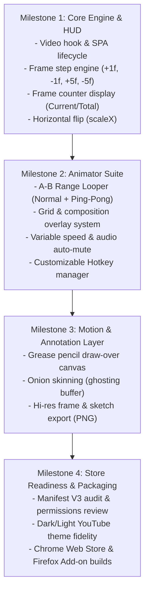

# Project Specifications: Animator-Playback (YouTube Extension)

## 1. Executive Summary & Vision
**Animator-Playback** is a specialized browser extension designed to turn YouTube into a high-precision animation reference and video analysis workstation. 

While YouTube is the largest repository of real-world motion, dance choreography, fight scenes, animal mechanics, and master animation clips, its native video player is ill-suited for frame-by-frame study (lacking true frame counters, horizontal canvas flipping, custom composition grids, arc tracking, and fine-tuned playback controls). 

This extension bridges the gap between raw video reference and animation workflow tools (like SyncSketch, TVPaint, Blender, and Maya), empowering 2D/3D animators, storyboard artists, choreographers, and motion designers to break down keyframes, inspect arcs of motion, and evaluate silhouettes directly in their browser.

---

## 2. Core Functional Requirements & Feature Expansion

### 2.1. Frame-Accurate Playback Engine
* **Frame Stepping Controls:**
  * Micro-stepping: `+1 Frame`, `-1 Frame`
  * Chunk-stepping: `+5 Frames`, `-5 Frames` (standard beat jump)
  * Custom / Keyframe jumps: `+12f / -12f` (half-second at 24fps), `+24f / -24f` (1 second)
  * Continuous frame-advance on key hold with throttled cadence.
* **FPS Detection & Timing Calculation:**
  * **Auto-detection**: Inspect video stream metadata via `HTMLVideoElement.getVideoPlaybackQuality()` and `requestVideoFrameCallback()` presentation timestamps to infer native framerate (typically 23.976, 24, 25, 29.97, 30, 50, or 60 fps).
  * **Manual FPS Override Selector**: Dropdown + custom numeric input to force `24 FPS` (traditional cinema/animation), `12 FPS` (animating on 2s), `30 FPS`, `60 FPS`, etc.
* **Frame Counting & Timecode Display:**
  * Dual display formats:
    1. **Frame Count**: `Frame: [Current] / [Total]` (e.g., `Frame: 142 / 720`)
    2. **SMPTE Timecode**: `HH:MM:SS:FF` (Hours:Minutes:Seconds:Frames)
  * Interactive Jump: Clicking the frame number opens a small input to jump to a specific frame instantly.

### 2.2. A-B Range Looper (Pose-to-Pose & Cycle Breakdown)
* **Mark In (Point A) & Mark Out (Point B)**: Set precise start/end frames for continuous looping (e.g., studying a 12-frame walk cycle or a 24-frame sword swing).
* **Loop Modes**:
  * **Standard Repeat**: Jumps back to A immediately upon reaching B.
  * **Ping-Pong / Yo-Yo**: Reverses direction at boundaries (A $\rightarrow$ B $\rightarrow$ A), ideal for analyzing weight shifts and anticipation.
* **Trim & Clear Controls**: Quick buttons to nudge A/B markers by $\pm 1\text{f}$ or reset range.

### 2.3. Canvas Transformation & Silhouette Suite
* **Canvas Mirroring / Inversion:**
  * **Horizontal Flip (X-axis)**: CSS `transform: scaleX(-1)` to test composition balance, eye flow, and avoid bias.
  * **Vertical Flip (Y-axis)**: `transform: scaleY(-1)` for specialized visual rhythm checks.
  * **Rotation**: `90°`, `180°`, `270°` for vertical videos or acrobatic reference.
* **Silhouette / Value Mode:**
  * One-click high-contrast / threshold binarization filter (pure black-and-white silhouette) to evaluate line of action, negative space, and readability.

### 2.4. Grid & Composition Overlay Suite
* **Overlay Types:**
  * **Rule of Thirds** (3x3 grid)
  * **Golden Ratio / Golden Spiral** (Phi layout)
  * **Dynamic Metric Grid** ($4\times4$, $8\times8$, $16\times16$, or custom $N\times M$ pixel cells)
  * **Isometric / Perspective Guide** (1-point and 2-point horizon vanishing lines)
  * **Center Crosshair & Safe Action / Safe Title** guides (16:9, 4:3, 1:1, 9:16)
* **Customization Settings:**
  * Line color picker (White, Black, Red, Cyan, Neon Green, Yellow).
  * Line opacity slider ($0\% - 100\%$).
  * Line thickness ($1\text{px} - 5\text{px}$) and style (Solid, Dashed).

### 2.5. Motion Analysis & Onion Skinning (Advanced Animator Toolset)
* **Onion Skinning (Ghosting Frame Buffer):**
  * Capture and display the previous frame ($f_{-1}, f_{-2}$) or next frame ($f_{+1}$) semi-transparently over the current frame.
  * Essential for checking spacing (ease-in, ease-out) and overlapping action.
* **Motion Arc Tracker / Grease Pencil (Draw-over Layer):**
  * Transparent HTML5 canvas overlay on top of the player.
  * **Pen Tool**: Draw arcs, paths of action, timing charts directly over the video.
  * **Color / Size Palette**: Quick color swatches (Red, Blue, Green, Yellow) and eraser.
  * **Clear & Undo/Redo**: Fast hotkeys to scrub lines.

### 2.6. Variable Speed & Playback Engine
* **Speed Granularity:**
  * Presets: `0.05x`, `0.1x`, `0.25x`, `0.5x`, `0.75x`, `1.0x`, `1.25x`, `1.5x`, `2.0x`.
  * Continuous slider: Step increments of $0.05\text{x}$ from $0.05\text{x}$ to $4.0\text{x}$.
* **Audio Handling:**
  * Auto-mute toggle when speed is $< 0.5\text{x}$ (eliminates jarring stutter/pitch distortion).
  * Pitch correction toggle.

### 2.7. Snapshot & Frame Export Suite
* **High-Res Frame Capture:**
  * Render the current frame at native video source resolution to an offscreen `<canvas>` and download as `.png` or `.webp`.
  * Option to export clean frame OR frame with current drawings/grid overlay.
* **A-B Clip Export (Optional / Stretch):**
  * Export looped sequence as an animated `.gif` or lightweight `.webm` clip for import into Maya/Blender/Krita.

---

## 3. Keyboard Shortcut Architecture (Default Animator Layout)

Speed is critical for animators. All keybindings must be customizable with presets matching industry-standard software:

| Action | Default Hotkey | TVPaint / Blender Preset | QuickTime Preset |
| :--- | :--- | :--- | :--- |
| **Play / Pause** | `Space` / `K` | `Space` / `Alt+A` | `Space` |
| **Previous Frame (-1f)** | `,` (Comma) | `Left Arrow` / `,` | `Left Arrow` |
| **Next Frame (+1f)** | `.` (Period) | `Right Arrow` / `.` | `Right Arrow` |
| **Jump -5 Frames** | `Shift + ,` | `Shift + Left Arrow` | `Shift + Left Arrow` |
| **Jump +5 Frames** | `Shift + .` | `Shift + Right Arrow`| `Shift + Right Arrow`|
| **Set In Point (A)** | `[` or `I` | `I` | `I` |
| **Set Out Point (B)** | `]` or `O` | `O` | `O` |
| **Toggle A-B Loop** | `L` | `Shift + L` | `Cmd/Ctrl + L` |
| **Flip Canvas (X-axis)**| `F` or `M` | `F` | `Shift + M` |
| **Toggle Grid** | `G` | `G` | `G` |
| **Toggle Onion Skin** | `O` (or `Shift + O`)| `Shift + O` | `Alt + O` |
| **Speed Down / Up** | `[` / `]` or `-` / `+`| `[` / `]` | `J` / `L` |

---

## 4. Technical Architecture (Manifest V3)

```
animator-playback/
├── manifest.json              # Chrome/Firefox Manifest V3 configuration
├── background/
│   └── service-worker.ts      # Background lifecycle, cross-tab state, store sync
├── content/
│   ├── index.ts               # Content script entry point, SPA navigation observer
│   ├── video-controller.ts    # HTMLVideoElement hook, frame-step engine, FPS clock
│   ├── ui/
│   │   ├── hud-overlay.ts     # Injected Shadow DOM floating controller & toolbar
│   │   ├── grid-renderer.ts   # Canvas/SVG overlay for dynamic grids and perspective
│   │   ├── drawing-canvas.ts  # Grease pencil drawing layer
│   │   └── styles.css         # Scoped styles (Shadow DOM isolated)
│   └── utils/
│       ├── fps-detector.ts    # rVFC & presentation timestamp heuristics
│       └── storage.ts         # Chrome Storage API wrapper for user presets
├── popup/
│   ├── popup.html             # Extension action popup (global settings, keybinds)
│   ├── popup.ts               # Hotkey configuration UI & preset manager
│   └── popup.css
└── icons/
    ├── icon-16.png
    ├── icon-48.png
    └── icon-128.png
```

### 4.1. DOM Injection & YouTube SPA Navigation
* **Shadow DOM Isolation**: Inject UI using `element.attachShadow({ mode: 'open' })` inside the `#movie_player` container or sibling overlay. This prevents YouTube CSS leaks and protects extension styles from YouTube redesigns.
* **YouTube SPA Page Transitions**: Listen for YouTube custom events:
  * `yt-navigate-finish`
  * `spfdone`
  * `yt-page-data-updated`
  * Re-attach video listeners when the active `<video>` element is swapped.

### 4.2. Frame-Accurate Seeking Implementation
* Seeking in standard HTML5 video via `video.currentTime += 1 / fps` can cause rounding jitter due to GOP (Group of Pictures) keyframe compression.
* Solution:
  1. Utilize the `requestVideoFrameCallback()` (rVFC) API to observe true metadata rendering timestamps `now` and `metadata.mediaTime`.
  2. Implement a precise seek lock that prevents rapid-fire key spamming from drifting out of sync.

---

## 5. Potential Pitfalls, Edge Cases & Mitigation Strategies

| Edge Case / Pitfall | Impact | Mitigation Strategy |
| :--- | :--- | :--- |
| **YouTube Pre-roll / Mid-roll Ads** | Frame numbers and time calculations will attach to the ad video rather than the target content. | Monitor `.ad-showing` class on `#movie_player`. Automatically disable HUD or pause overlay until the main video stream begins. |
| **Variable / Non-Standard FPS** | Audio/video drift, inaccurate frame counter (e.g. 29.97 vs 30 fps). | Provide dynamic FPS estimator + visible 1-click override toolbar in the HUD so animators can lock 24fps instantly. |
| **Fullscreen & Theater Modes** | HUD positioning breaks or disappears behind the fullscreen video player. | Attach the HUD inside the `#movie_player` element hierarchy directly so it inherits fullscreen context automatically. |
| **YouTube Native Hotkey Conflicts** | Pressing `F` natively toggles fullscreen; `,` and `.` natively step in YouTube's built-in player. | Intercept keyboard events in capture phase (`addEventListener('keydown', handler, true)`), call `event.stopImmediatePropagation()` and `event.preventDefault()` when custom keys match. |
| **Canvas Taint (CORS) on Screenshot**| Canvas `.toDataURL()` or `.getImageData()` throws SecurityError on cross-origin video streams. | YouTube serves same-origin or CORS-enabled streams on HTML5 player. If cross-origin restrictions apply, fallback to Chrome Tab Capture API (`chrome.tabs.captureVisibleTab`) cropped to video bounds. |

---

## 6. Implementation & Deployment Roadmap



---

## 7. The Grill: Key Architectural Decisions for You

Before writing code, answer these critical product and engineering questions:

1. **Grease Pencil Scope for MVP**:
   * *Option A*: Include full in-browser drawing canvas (pen, eraser, color swatches) in Version 1.0.
   * *Option B*: Keep v1.0 focused strictly on playback, flipping, frame counter, and grids; roll out draw-overs in v1.1.
2. **UI Placement Style**:
   * *Option A*: Integrated directly into YouTube's native control bar (bottom bar next to settings gear).
   * *Option B*: Floating, draggable, collapsible HUD bar over or beside the video player.
3. **Ghosting / Onion Skinning Performance**:
   * Storing previous frames requires capturing video frames onto an offscreen canvas in memory. Do you want onion skinning enabled by default or as an explicit toggle?
4. **Target Browser Support**:
   * Chrome & Chromium only (Edge/Brave/Opera) OR Cross-browser (Chrome MV3 + Firefox MV2/MV3)?
